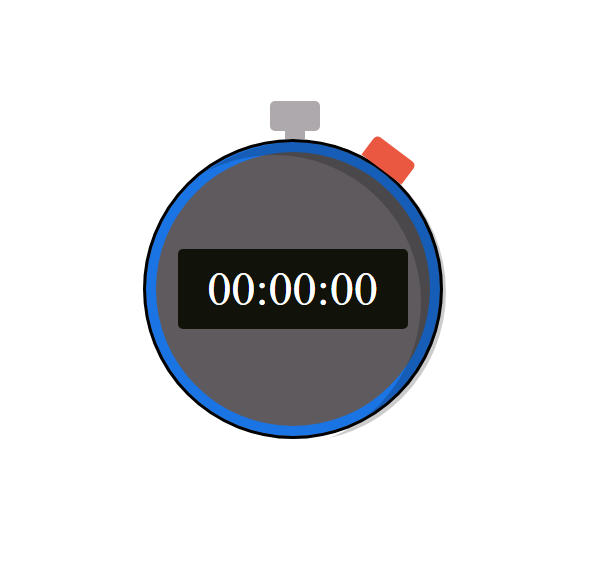

# STOPWATCH

This is a stopwatch made with vanilla JS and SCSS

### Screenshot

### Built with

- Vanilla JS
- SCSS
- Flexbox
- CSS Grid

### What I learned

For this project i had to learn about positioning and pseudo classes to make the html more accurate to a real stopwatch.

### Function

- The red button is the start / stop button.
- The top and gray button is the reset button.

## Author

- Website - [Portfolio](http://leo-coronel.com.ar)
- Github - [@LeoCoronel](https://https://github.com/LeoCoronel)